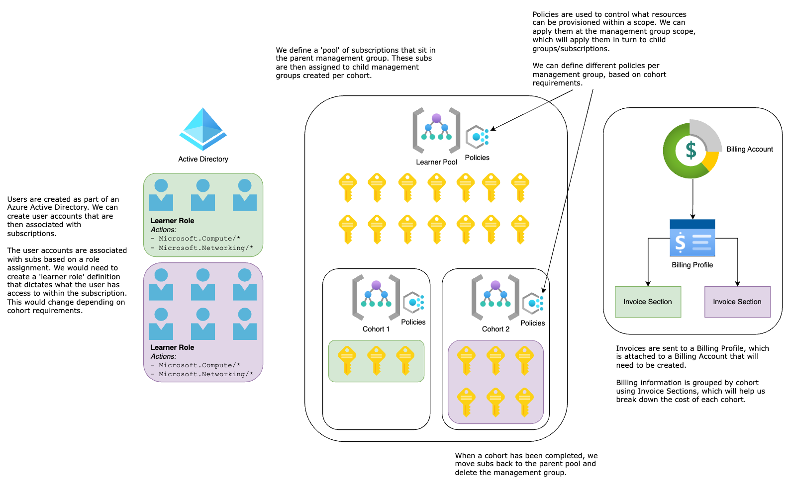

# Azure Sandbox Provisioner

## Contents
- [Azure Sandbox Provisioner](#azure-sandbox-provisioner)
  - [Contents](#contents)
  - [Structure](#structure)
    - [Billing](#billing)
    - [Configuration](#configuration)
  - [Automation](#automation)
    - [Subscription Assignment](#subscription-assignment)

## Structure

The basic structure consists of Azure Subscriptions that are grouped into Management Groups based on courses. Subscriptions are groupings of Azure resources, and Management Groups are logical groupings of Subscriptions. We would start by provisioning a set of Learner Subscriptions (let's say 100 Subscriptions) that sit in the 'Subscription Pool' Management Group, which is essentially just a holding space for Subscriptions while they are not being used for learner environments. This pool can be increased/decreased easily, depending on our required capacity.

When cloud environments are needed for a cohort, say a group of 20 learners, we create a Management Group and move 20 Subscriptions from the Subscription Pool to the cohort's Group. Grouping Subscriptions this way allows us to impose restrictions on resources, so we can prevent learners from provisioning massive virtual machines at cost to the business.

As Subscriptions are moved into the Group, learners are given access to the Subscription via their Active Directory user. The user's access to the Subscription and the resources under it is controlled based on their role, which we can customise according to the requirements of the cohort. Billing alerts can also be set up for Subscriptions, allowing us to set up budgets per user per cohort that will notify us when a learner is racking up a large bill.

When the course has finished, we simply revoke the users' access to the Subscription, delete all resources associated with each Subscription, move those Subscriptions back into the Subscription Pool and delete the cohort's Management Group.

Naturally, this entire process will be automated. I have been creating a Terraform configuration that handles the bulk of this infrastructure and am working on scripts that will handle moving Subscriptions from one Group to another. The eventual goal is to create a pipeline (perhaps hosted in Azure DevOps?) that will automate this process for us, and all the operations team would have to do is fill out a configuration file (probably in JSON/YAML) with the cohort requirements.

The configuration I've got so far is coming along promisingly (I'm able to create subscriptions, groups, impose resource restrictions and create RBAC roles), but there are a number of limitations I'm facing that I go over later in this email. 

### Billing

All Subscriptions will be associated with a Billing Account such that all resources will charged to that one account. A Billing Account contains Billing Profiles, where invoices are sent to, which is in turn split into Invoice Sections which allow us to break costs down further. Subscriptions are associated with an Invoice Section, so we can group our costs per cohort and charge the client accordingly. Automating this process is not so simple, unfortunately, but should be doable.

### Configuration

The configuration is designed to be set using a YAML file called `config.yaml` in the root of the directory. It describes the number of available Subscriptions in the Subscription Pool, the list of cohorts with their attributes and a list of role definitions for learners.

An example of the `config.yaml` file is provided in [`config-template.yaml`](./config-template.yaml).

The Terraform configuration is designed to generate as many Subscriptions and Management Groups as needed to fulfill the configuration defined in the `config.yaml` file.

## Automation

### Subscription Assignment

Dynamic assignment of Subscriptions to Management Groups is handled by the [`scripts/assign_subscriptions.py`](scripts/assign_subscriptions.py) Python script. Initially I attempted to handle this process using Terraform but it didn't handle changes to the state very well. Instead, provisioning everything with Terraform and then managing Subscription assignment with Python appears to work well.

There are still issues that arise with Subscription assignment. The following is an excerpt from [`scripts/operations/setters.py`](./scripts/operations/setters.py):

> This solution is incomplete. If group1 has 10 subscriptions and group 2 has 5, and group1 shrinks from 10 -> 9
  and group2 grows from 5 -> 6, group 2 will still be processed first. If there are no spare subscriptions in the pool, the script will break.
>  
> A better solution would be to find the difference between the config and the current state to determine which groups are shrinking vs which are growing, and then process the shrinking groups first (ordered by desired count in ascending order) followed by growing cohorts.
